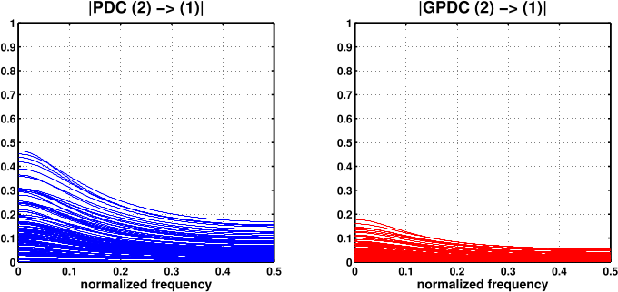
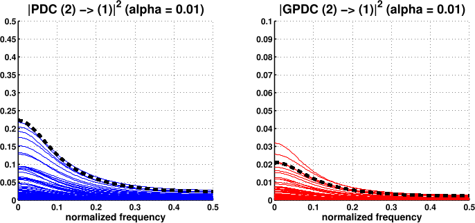

# Baccala2008
Baccalá, Luiz A. and Sameshima, K. "Generalized Partial Directed Coherence" (2008)

## Description
Here we work with a bivariate time series, simulated by a MVAR process with the following equations
$$\left\{\begin{array}{lll}
x_{1}(n) &=& a_{11}x_{1}(n-1) + a_{12}x_{2}(n-1) + w_{1}(n) \\
x_{2}(n) &=& a_{22}x_{2}(n-1) + w_{2}(n)
\end{array}\right.$$

Fixing $a_{11} = a_{12} = a_{22} = 0.5$, and ${\boldsymbol \Sigma}_{\bf w}$ such that $\sigma_{1}^{2} = 1$ and $\sigma_{2}^{2} = 10$, we simulate 100 trials of ${\bf x}(n)$.

The figures below are all generated using the Matlab script `generatefigure.m`

## Figure 1
Fixing the number of samples to $N_{S} = 128$, we generated 100 trials of ${\bf x}(n)$ and estimated a MVAR model of order 1 to each one of them. Then, the PDC and gPDC between channels was calculated for each trial. The figure below shows the 100 results for the connectivity estimation from channel 2 to channel 1, which in theory should be zero.

 

From the results above we see that the PDC has a much higher variability than the gPDC for this case. In fact, although the PDC from 2 to 1 should be zero, in some cases its estimated value is as high as 0.5! As for the gPDC, the maximum value that we see in the plots is 0.2, which is not perfect but certainly more controlled than for PDC. This behavior can be traced back to the 10:1 ratio between the elements in the diagonal of ${\boldsymbol \Sigma}_{\bf w}$, which ends up affecting more strongly the PDC due to its lack of scale-invariancy.

## Figure 2

The asymptotic statistical analysis of the PDC has given us the possibility of performing the following hypothesis test:
$$ \left\{
\begin{array}{cc}
\mathcal{H}_{0}: & |\pi_{ij}(f)|^2 = 0 \\
\mathcal{H}_{1}: & |\pi_{ij}(f)|^2 \neq 0
\end{array}
\right.
$$

In this way, from the estimates of $|\pi_{ij}(f)|^2$ we can rigorously say whether $\mathcal{H}_{0}$ should be rejected or not at a given $\alpha$ level and, if yes, say that $|\pi_{ij}(f)|^2$ is statistically significant different than zero. The easiest way of performing such hypothesis test is to determine a threshold $t_{\alpha}$ and say that $|\pi_{ij}(f)|^2$ is significantly different than zero with a probability of $1-\alpha$ if $|\pi_{ij}(f)|^2 > t_{\alpha}$.

Now we plot the same results as before but with the thresholds of significance for the PDC and gPDC from channel 2 to channel 1 at $\alpha = 0.01$. Note, however, that the results are now plotted with the squared absolute values of the estimated values, and the y axis are no longer the same.

 

From the results we see that although the PDC has a higher variability that the gPDC, the threshold values are higher too, so the rate of false rejections with each estimator is the same.

## Conclusion

From the simulations above we conclude that the gPDC is more adequate than the PDC when the energies (or variances) of each channel are very different from each other. This is why I've chosen to always use the gPDC in my estimations with real EEG data, because I should not assume that the variances in each channel will always stay at the same comparable level. Moreover, gPDC's values are usually better for visually inspecting the results of connectivity estimation, which is quite useful when one wants just to plot a time-frequency representation and make initial guesses. It should be noted, though, that if one can calculate the thresholds for statistical significance, both estimators should work just fine and lead to the correct conclusions regarding causality and connectivity.
