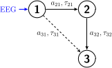
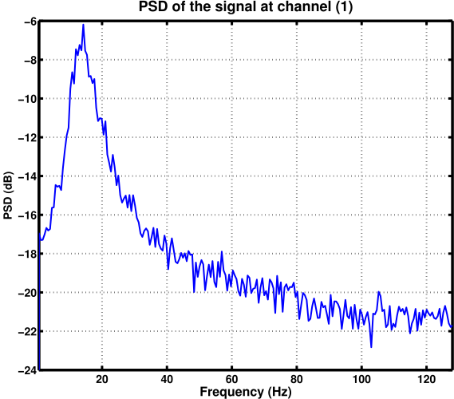
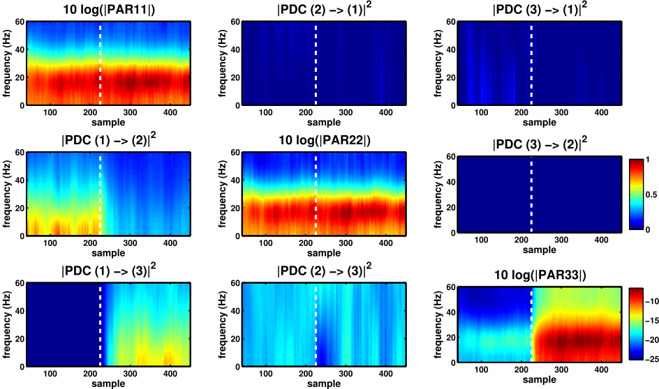
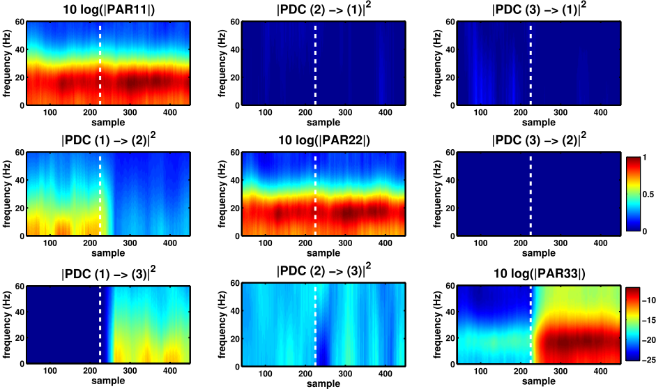
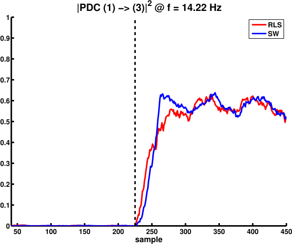

# Astolfi2008
Astolfi, Laura et al. "Tracking the time-varying cortical connectivity patterns by adaptive multivariate estimators"

## Description
In this folder you have a `generateresults.m` script for performing the estimation procedures and then save the results in a `.mat` file. The `generatefigures.m` script loads the previous results and plots the relevant figures.

My goal here is to reproduce the toy model in Laura Astolfi's article from 2008, where she studies the performance of a recursive least-squares algorithm (RLS) in the tracking of neural connectivity. The example is a three channel one, which is not a MVAR process *per se*, but can be well modelled by one. In fact, we have the following equations

$$\left\{\begin{array}{lll}
x_{1}(n) &=& s(n) + w_{1}(n) \\
x_{2}(n) &=& 0.6x_{1}(n-1) + w_{2}(n) \\
x_{3}(n) &=& a_{31}x_{1}(n-2) + 0.7x_{2}(n-1) + w_{3}(n)
\end{array}\right.$$

where $s(n)$ is a simulated EEG signal generated by a neural mass model. The coefficient $a_{31}$ is equal to 0.0 at first but then is switched to 0.9 at $n = n_{\text{switch}}$. The $w_{i}(n)$ are white Gaussian noise with variances fixed according to some desired SNR.

The connections of this toy model can be summarized in the following graph

Besides reproducing the results in Astolfi's article, I also wanted to show that a sliding-window algorithm is capable of giving the same results as the RLS, as well as allowing us to perform statistical significance tests on the estimates' values.

During the estimations, we consider $N_{S} = 450$ samples and $N_{T} = 80$ trials. Both the SW and RLS algorithms are capable of estimating a joint model for these multiple trials.

## Figure 1
Here below you see the power spectral density of the input signal $s(n)$, which was generated by a neural mass model tuned to simulate EEG signals at the alpha band.

 

PSD's peak at $\simeq 14$ Hz and its $1/f$ decay confirms that the input signal is indeed oscillating at the alpha band with a very similar behavior that what one would expect in EEG signals.

## Figure 2
To form a time-frequency map for the PDC between each pair of channels, we rely on a two-step procedure:

    1. Estimate a MVAR model for each time instant n
    2. From the matrix coefficients of this MVAR model, estimate the PDC at n

As already mentioned, two options are possible for estimating the MVAR models: a sliding-window approach or a RLS algorithm. The RLS algorithm is much faster than the sliding-window procedure, but it lacks the possibility of calculating thresholds for statistical significance of the estimated PDC values. Moreover, the idea of a forgetting factor in the RLS is not as intuitive as that of sliding-window, whose size can be readily associated to the expected resolution in the time-frequency representation.

Here below I plot the time-frequency representations for the PDC between channels using the RLS algorithm with a forgetting factor $C = 0.05$.

 

The next figure portrays the time-frequency representations for the PDC between channels using the SW algorithm with a window of $L = 32$ points.

 

Note that the results with both procedures are pratically the same (to be honest, I can hardly see any difference).

As mentioned before, the $a_{31}$ coefficient is turned on at $n = 225$, and we can see that the  $\pi_{31}$'s time-frequency representation with both algorithms effectively tracks this change. Additionaly, we can see that the autospectrum (or power) at channel 3 suddenly increases when the connection from 1 to 3 is turned on.

## Figure 3

It's always nice to see a "slice" of the previous time-frequency representations so as to check how the PDC values at one given frequency evolve through time. In the figure below, I compare the results for $\pi_{31}$ with SW (blue) and RLS (red) at the frequency $f = 14.22$ Hz.

 

Obviously, if one changes the forgetting factor $C$ or the sliding-window size $L$, the transition from off to on state in the graph will change too.

## Conclusion

The previous figures show a situation where the change of a coefficient in the MVAR process generating ${\bf x}(n)$ leads to a change in the network structure of the multichannel recording. Estimations with a sliding-window and the RLS algorithm give similar results, as shown in the time-frequency maps. However, it should be noted that we don't know of any published results showing a procedure for assessing the statistical significance of the estimated PDCs when using the RLS algorithm, whereas for the SW approach we have proposed one (see ../../embc2016 for more information).   
