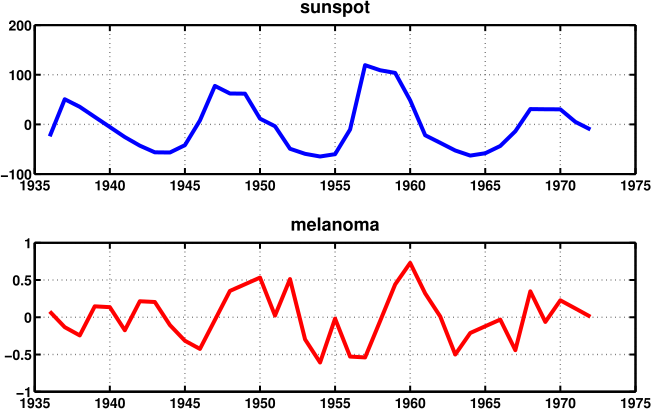
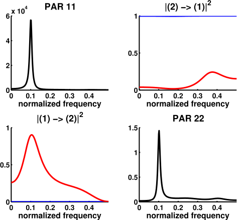
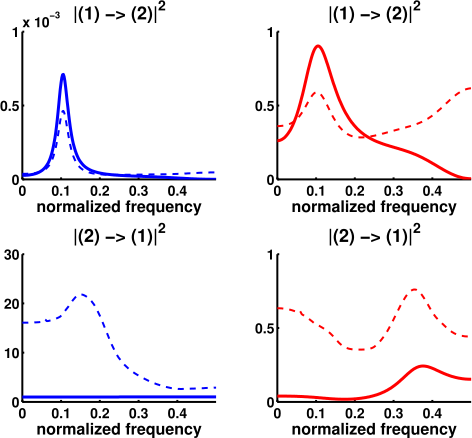

# SunspotData

Stein, Carlos et al. "Asymptotic Behavior of Generalized Partial Directed Coherence"

## Description
In this example, I apply the PDC to a time series which has nothing to do with EEG nor brain signals whatsoever. In fact, the two time series represent the incidence of melanoma in the state of Connecticut and Wolfer's sunspot data. The expected results of our causality analysis is that the sunspot time series should have a direct effect on the number of melanomas across the years, not the other way around.

The `sunmeladat.m` is a script for storing the time series values in a Matlab array. The figures can be generated with the scrip `generatefigures.m`

## Figure 1
Here below I show the plot of the two time series, after a detrending on each one of them. Note that we have only 37 samples, so the MVAR model to be estimated cannot be expected to provide a very good fit.

 

## Figure 2
Using Akaike's Information Criterion, we are lead to conclude that a reasonable order for a MVAR model would be $p = 4$. After estimating the matrix coefficients, I estimate the PDC and gPDC between channels, as well as autospectrum for each one of them.

In the plot below, the results with the PDC are displayed in blue, whereas the gPDC is portrayed in red. Channel 1 is sunspot and channel 2 is melanoma.

 

There are a few things to notice here. First, the values of the PDC would lead us to conclude that is the melanoma who causes the sunspot time series, a rather unrealistic result. However, the gPDC says the opposite. This discrepancy can be explained by the ratio of the powers in each channel, where we see that channel 1 has much more power than channel 2. This indicates a very unbalanced regime, one in which our example in `../2-Baccala2008` has shown that the PDC is expected to have problems.

Another interesting thing is that the peak in channel 1's autospectrum agrees with the peak in the gPDC from (1) to (2). This happens quite often in practice, as we shall see in other examples.

## Figure 3

The plot below shows the results from the PDC and gPDC estimates in the previous figure, but now showing their respective thresholds for statistical significance as well (note that the y axis are no longer the same). Just like before, PDC is in blue and gPDC in red.

 

A quite impressive result that we can see from these plots is that the thresholds for statistical significance are scaled so that both the PDC and gPDC indicate a causality relation from channel 1 to channel 2, not the contrary. In fact, for the (2) to (1) case we see that the threshold goes as high as 25, a value that no gPDC could ever attain. Also, although PDC from (1) to (2) is very low, its threshold for significance is also very low, so that the null hypothesis has to be rejected.

## Conclusion

This example is interesting for a number of reasons. Firstly, because the time series has nothing to do with brain signals and yet we can use the PDC for inferring causal relations between them, although there is no easy interpretation to what a normalized frequency in this case would mean.

Also, the unbalance between the powers in each time series is shown to cause serious problems on the causality analysis based on the PDC, but not much happens when we use the gPDC. Nevertheless, with the thresholds for statistical significance we see that both estimators can give be used for causality studies, but one is much better for visual inspection than the other.
