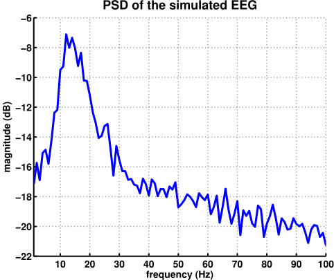
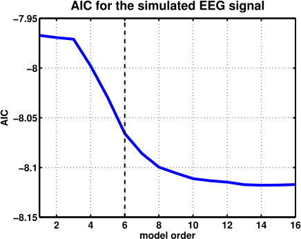
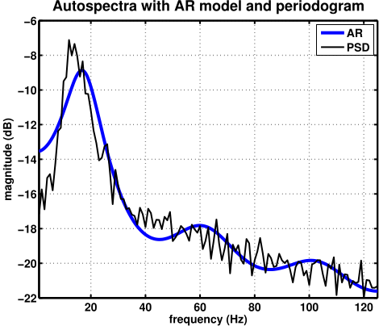
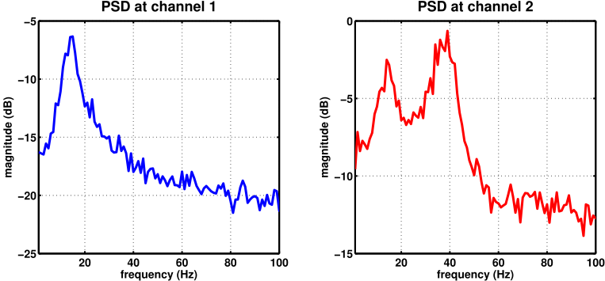
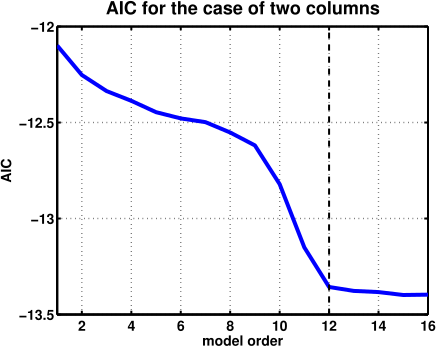
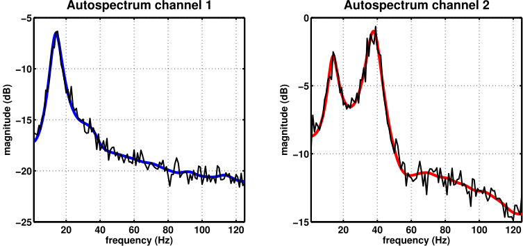

# Neuralmass

## Description

In this folder we have a `generateresults.m` script for performing the estimations and a `generatefigures.m` script for plotting the results. The `data_single.mat` and `data_double.mat` files store the results of the estimations, so that you can directly generate the figures without losing time on new estimations everytime.

The `/subroutines` folder has two important scripts: `generateEEG_SingleCorticalColumn.m` and `generateEEG_DoubleCorticalColumn`. They implement the nonlinear model developed by Lopes da Silva [1] and improved by Jansen [2]  and Olivier David [3]. Basically, this model generates signals which have very similar behavior to EEG recorded in real life, with a peak in some frequency band (alpha, beta, etc.) and a $1/f$ decrease along the frequency domain. The single cortical column simulates an EEG signal oscillating mostly in the alpha band ($\simeq 10$ Hz), whereas the double cortical column simulates two EEG signals which are connected and influence each other, with one oscillating in the beta band ($\simeq 22$ Hz) and the other in the gamma band ($\simeq 41$ Hz).

## Single column
First we should plot the signal generated by the single cortical column so that you can be sure that it "looks like" an EEG.

If you're still not convinced, maybe you would prefer to see the signal's power spectral density (PSD).

Note that this PSD was estimated using the periodogram, which simply calculates the FFT of the signal and averages it along the available trials (which in this case were $N_{T} = 50$).

Ok, now let's see if we can use an autoregressive model to model this signal and its power spectrum. First we should use Akaike's Information Criterion to set a reasonable order for the model. This helps to avoid overfitting the data.

We choose $p_{\text{est}} = 6$ because this seems to be the "knee" of the AIC curve, indicating that models with higher order won't give much more improvement to the estimations. I could have chosen an order 8 too, but it didn't really improve the results.

Here below you see the resulting autospectrum from the AR model for the EEG signal and the PSD calculated with the periodogram. Note that they agree pretty well.

## Double column
Ok, let's continue our exploration, but this time with two connected cortical columns. Cortical column 1 (or channel 1) has a causal influence over column (or channel) 2. We expect to see this causality in our estimations with the PDC.

First we plot the signals in each channel.

Now we would like to see the PSD for the signals at each channel. For this, we use the periodogram estimator. Note that channel 1 has a peak in the beta band and channel 2 has two peaks, one in the beta and one in gamma. This happens because channel 1 is influencing channel 2 via its connection, which in turn makes channel 2 have its own beta oscillation as well as the alpha one coming from channel 1.

Now it's time for estimating a MVAR model from this bivariate time series. We first use the AIC critetion to choose a model order.
Now we would like to see the periodograms.

It seems that a model with order 12 should do the job. Let's see how the autospectra estimated with such a model would look like

Yep, it looks great! We can also estimate the gPDC between the channels and see whether it will lead us to conclude that there is a causality relation between channel 1 and channel 2.

Oh yeah! This is just what we expected: the gPDC indicates that there is causality from channel 1 to channel 2, but not the other way around. We could also plot the gPDC values along with its thresholds of statistical significance at a 1% level.

As you can see, the gPDC from (2) to (1) is never above the thresholds for statistical significance.

## Conclusions
The results show that, although the EEG signals were simulated with a nonlinear model, our linear MVAR estimation is capable of capturing the main features of the signals, such as peaks in the autospectra and causality relations between the channels. This might seem quite elementary, but it should be noted that most toy models in the neural connectivity literature estimation are based on signals simulated with perfectly linear MVAR processes, a rather simplistic view of the world. This is not to say that MVAR and gPDC is always capable of capturing connectivity relations in any nonlinear model, but at least in this particular case (which has a great deal of interest in the neuroscience community), the estimations worked just fine.  

---
#### References

[1] Lopes da Silva, F. et al. "Model of brain rhythmic activity - The alpha-rhythm of the thalamus" (1974)

[2] Jansen, B. and Rit, V. "Electroencephalogram and visual evoked potential generation in a mathematical model of coupled cortical columns" (1995)

[3] David, O. and Friston, K. "A neural mass model for MEG/EEG: Coupling and neuronal dynamics" (2003)
