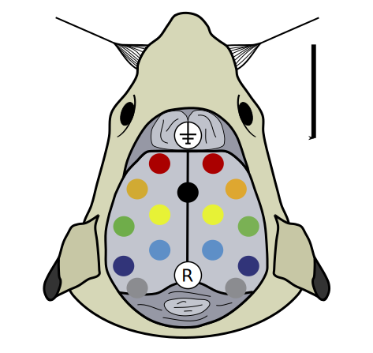
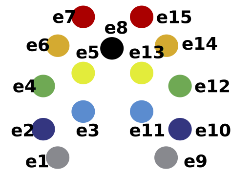
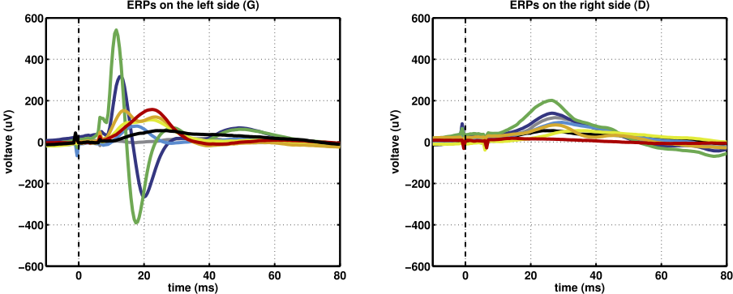
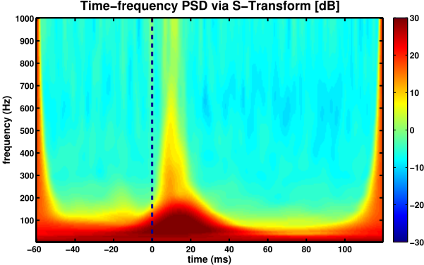
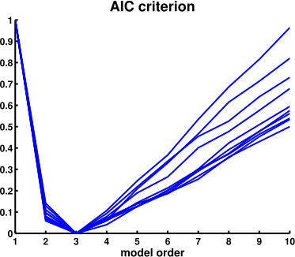
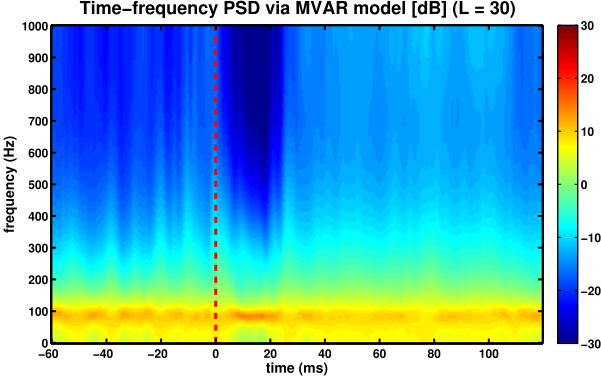
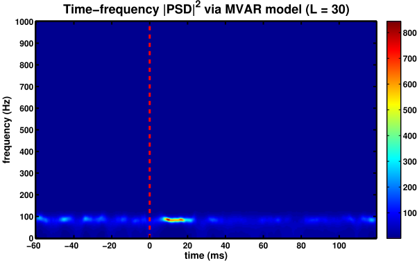
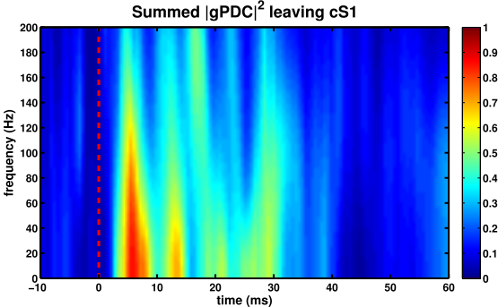
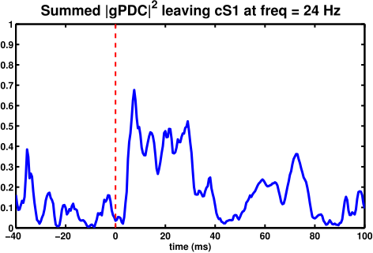

# Rat SEP

## Description

Here you will find two scripts: `generatefigures.m` and `generateresults.m`. The `generateresults.m` creates a `.mat` with the estimation results for each subject, whose data is stored in the subfolder `/data`. `generatefigures.m` loads the results and plot the figures.

The dataset we're working here is composed of real EEG data recorded on 15 channels on the scalp of p21 Wistar rats. It was an experiment conceived, designed and executed by [1] and has been studied in terms of neural connectivity estimation in [2]. Our main objective here was to compare our method of time-varying neural connectivity estimation with the one done by [2], which shows some technical limitations.

The experiment was basically concerned with how the rat's brain reacted to stimulus on his whiskers. In fact, approximately 5ms after each stimulus, we expect to see some neural activity in the contralateral somatosensory region, with it propagating to other regions and fading after 20ms.

The figures below show how electrodes were positioned on the rat's scalp. For instance, after a stimulus on the rat's right whisker, we expect to first see a reaction in the region of electrode e4, associated with the cS1 part of the brain, and then it propagating to other electrodes.

The data for each subject is composed of a matrix ${\bf x}$ with $N_{C} \times N_{S} \times N_{T}$ dimension, where $N_{C} = 15$ channels, $N_{S} = 360$ samples and $N_{T} = 50$ trials. Sampling frequency is $F_{S} = 2000$ Hz and the moment of stimulus on the rat's whisker is $n_{\text{stim}} = 120$.

## The evoked potentials

First we plot the evoked potentials on each side of the brain for a stimulus on the rat's right whisker. Note that the colors of each plot correspond to a location on the electrodes map. 

To plot these signals, we simply average the matrix ${\bf x}$ along its third dimension.

We see that the first electrode to produce some sort of evoked potential is electrode e4, as mentioned before. Then, other electrodes near to e4 start to activate and only after 20 ms some activity finally reaches the right side of the rat's brain.

## S-Transform

Here below we use the Stockwell transform [3] to plot a time-frequency representation of the power spectral density on channel e4. The S-transform is a nonparametric estimator, which is very similar to the Gabor transform in the sense that it uses a Gaussian window to slide through the time-frequency map. However, the width of the windows in the S-transform change with the frequency, meaning that the resolution of the analysis is different for each region of the spectra. 

Note that because of the Gaussian window, our tracking is quite smooth in time and frequency, meaning that we don't have a very good time-frequency resolution. Nevertheless, the plot shows sufficiently well that something happens right after the stimulus and it lasts for approximately 20 ms. Moreover, this activity is mainly concentrated in the [0, 100] Hz region of the spectrum.

## MVAR model

Our next step is to make a multivariate-autoregressive model from for the EEG recordings. We shall use a sliding-window procedure, where several MVAR models will be estimated for each time instant. The windows have size $L = 30$ points and we'll use the same model order for all of them.  

To decide a reasonable model order, we use the AIC criterion on a random number of windows to see what would be a good one. The figure below shows that an order equal to 3 would be just fine.

## Autospectrum time-frequency representation

From the MVAR models estimated at each window, we calculate the autospectrum for channel e4 and plot its time-frequency representations.

Note that now we have a much better time-frequency resolution if compared to the S-transform. In fact, we can say with precision in which frequency the PSD is stronger after the whisker stimulus.

## The gPDC leaving cS1

Finally, the last part of our analysis is the estimation of the outward gPDC leaving electrode e4 (cS1 region). The time-frequency representation here below show that we have a peak of activity right after the stimulus and it fades approximately 20 ms afterwards. The results are very similar to what was obtained in [2], but we use traditional and well established estimation procedures, as opposed to the ones in [2]. 

Figure below shows the time evolution of the gPDC leaving cS1 at frequency $f = 24$ Hz.

## Conclusion

These are just the results of a superficial analysis of the EEG data used in [1]. A more profound study, with more results and discussions, is available in the `EMBC2016.pdf` file in this repository.

---
#### References

[1] Quairiaux, C. et al. "Functional Development of Large-Scale Sensorimotor Cortical Networks in the Brain"

[2] Plomp et al. "The physiological plausibility of time-varying Granger-causal modeling: Normalization and weighting by spectral power"

[3] Stockwell, R.G. et al. "Localization of the complex spectrum: the S transform"
