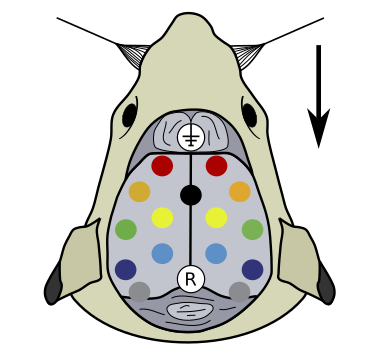
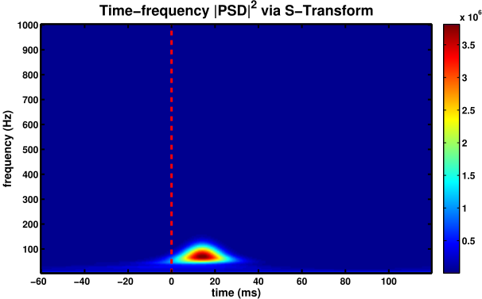

# Rat SEP

## Description

 

 

## The evoked potentials

 

## S-Transform

 

 

## MVAR model

 

## Autospectrum time-frequency representation

 

 

## The gPDC leaving cS1

 

 

## Conclusion

---
#### References

[1]

[2]

[3]
