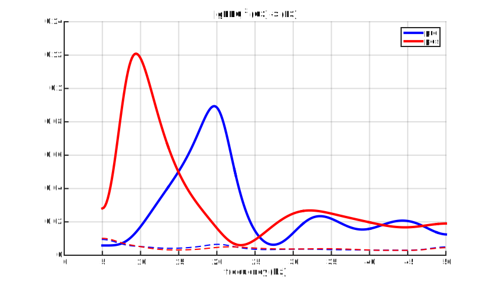

# Grasp and Lift
In this folder you have two scripts: `generateresults.m` and `generatefigures.m`. The first one is for making the estimations of things we're interested, whereas the second one loads the results from the `results.mat` file and plot them.

We used real EEG data available here and described in a very detailed article [1] from Nature. The dataset has been used in a competition for the [Kaggle](https://www.kaggle.com/c/grasp-and-lift-eeg-detection) website and is very good example for application of the algorithms that I've developed in my M.S. research.

## Description
Although the dataset from [1] has a lot of interesting features and different events to explore, my only goal here was to investigate how the neural connectivity between the EEG recordings changed due to a visual stimulus and then the movement of the subject's right arm.

The figure below shows the map with all 32 electrodes used in the experiment. To facilitate our estimations, and reduce the complexity of our models, I only used a subset of these channels: F3, F4, C3, C4, P3 and P4.  The reason for choosing them was the fact that many articles in the literature show that the electrodes C3 and C4 are the most affected by arm movement. With this said, we thought it would be interesting to see how the flow of information leaving Cx would behave: either upwise (to Fx) or downwise (to Px).

 

## Comparing periodograms

First thing we thought would be interesting was to estimate the power spectral density at C3 electrode before and after the visual stimulus (which is when the right arm movement begins). To do this, we averaged the periodograms from each of the $N_{T}=232$ trials in two windows of $L = 500$ points, which we called the **pre** window and **pos** window. Sampling frequency being $F_{S} = 500$ Hz means that each window lasted 1 second.

 

From the results in the above figure we see that there is a strong decrease ($\simeq 5$ dB) at the alpha band ($f \simeq 10$ Hz) when going from the **pre** window to the **pos** window.

An important thing to mention is the PSD's behavior in the lowest frequencies ($\leq 5$ Hz). We see that there's almost as much power to this band as to the peak at $10$ Hz. In fact, these very-low oscillations are not believed to have physiological meaning, being probably due to problems in the measuring apparatus or artifacts induced by subject's behavior. This lower band power causes severe problems to the signal's MVAR model estimation, since it ends up masking the main features which we would like to model. With that said, it would be interesting if we could estimate a MVAR model in just a sub-band of the frequency domain, something like from 5 Hz to 50 Hz. Well, this is what we did.

## Sub-band modeling

 

 

## The gPDC leaving C3

 

 

## Conclusion

---
#### References

[1] Luciw, M. et al. "Multi-channel EEG recordings during 3,936 grasp and lift trials with varying weight and friction"

[2] Pfurtscheller, G. et al. "Mu rhythm (de)synchronization and EEG single-trial classification of different motor imagery tasks"

[3]
