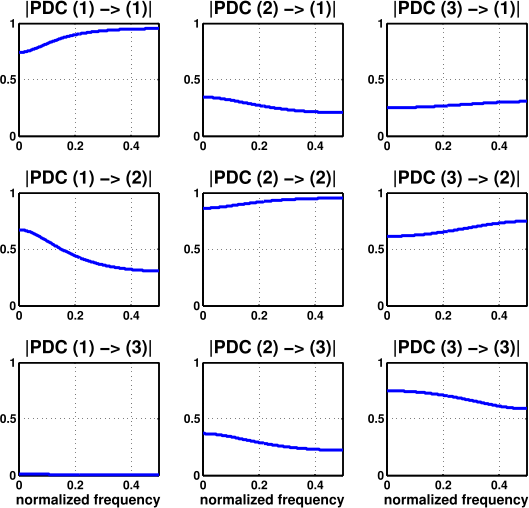
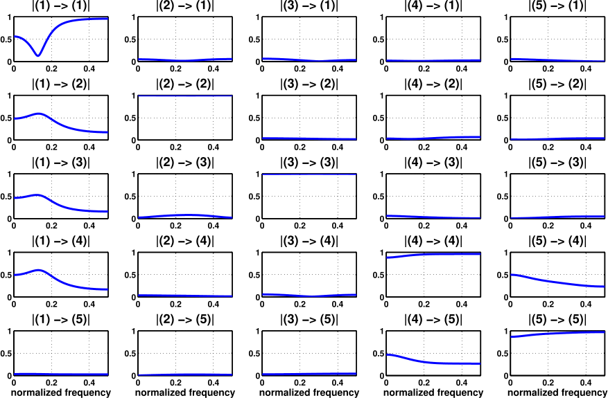
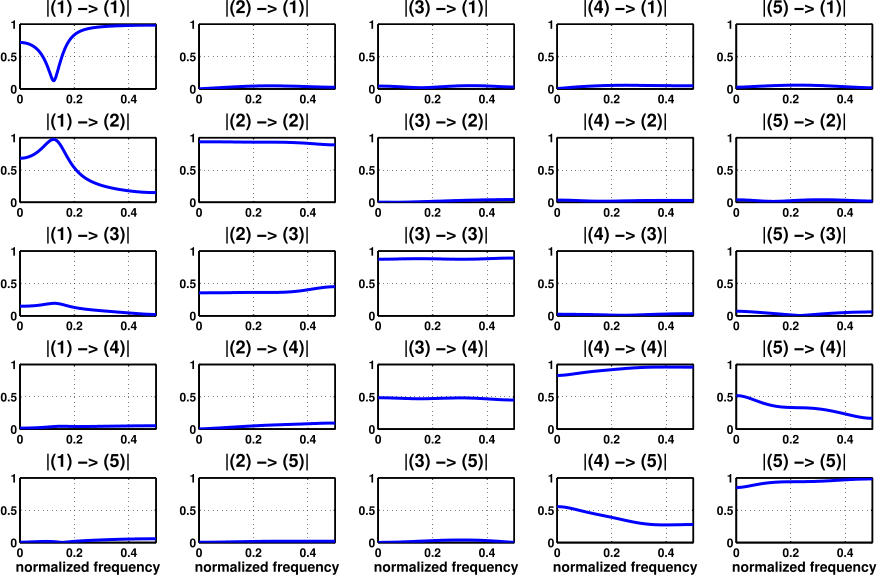

# Baccala2001
    Baccala, Luiz A. and Sameshima, K. "Partial directed coherence: a new concept in neural structure determination" (2001)

## Description
In this folder you have a `generatefigures.m` script for generating some of the figures in the referenced article.

Note that all examples are toy models, which means that the ${\bf x}(n)$ signals used for estimating MVAR models are actually generated with known equations, which in turn are MVAR processes. These toy models are designed in order to have particular connectivity patterns.

It should be noted too that the estimations in `generatefigures.m` were all done to illustrate the PDC, so, for simplicity, the order of the estimated models is exactly the order of the MVAR process which generated the samples.

## Figure 1
This example considers a multivariate time series ${\bf x}(n)$ generated by the following equations:

$$\left\{\begin{array}{lll}
x_{1}(n) &=& 0.5x_{1}(n-1) + 0.3x_{2}(n-1) + 0.4x_{3}(n-1) + w_{1}(n) \\
x_{2}(n) &=& -0.5x_{1}(n-1) + 0.3x_{2}(n-1) + 1.0x_{3}(n-1) + w_{2}(n) \\
x_{3}(n) &=& -0.3x_{2}(n-1) -0.2x_{3}(n-1) + w_{3}(n)
\end{array}\right.$$

where $w_{i}(n)$ are gaussian white noise with ${\boldsymbol \Sigma}_{{\bf w}} = {\bf I}_{3}$.

This leads to a connectivity pattern as shown below.

 

The results of the PDC estimation from a simulation of ${\bf x}(n)$ are obtained with `generatefigures.m`. The plots below display the absolute value of the PDC between each pair of channels.

## Figure 2
This example considers a multivariate time series ${\bf x}(n)$ generated by the following equations:

$$\left\{\begin{array}{lll}
x_{1}(n) &=& 0.95\sqrt{2}x_{1}(n-1) - 0.9025x_{1}(n-2) + w_{1}(n) \\
x_{2}(n) &=& 0.5x_{1}(n-2) + w_{2}(n) \\
x_{3}(n) &=& -0.4x_{1}(n-3) + w_{3}(n) \\
x_{4}(n) &=& -0.5x_{1}(n-2) + 0.25\sqrt{2}x_{4}(n-1) + 0.25\sqrt{2}x_{5}(n-1) + w_{4}(n) \\
x_{5}(n) &=& -0.25\sqrt{2}x_{4}(n-1) + 0.25\sqrt{2}x_{5}(n-1) + w_{5}(n)
\end{array}\right.$$

where $w_{i}(n)$ are gaussian white noise with ${\boldsymbol \Sigma}_{{\bf w}} = {\bf I}_{5}$.

This leads to a connectivity pattern as shown below.

 

Note that in this case we have some interesting patterns, such as a **loop** between channels 4 and 5 (they form an oscillator), and an **indirect connection** between channel 1 and channel 5. Let's see what results we get with the `generatefigures.m` script.

## Figure 5
This example considers a multivariate time series ${\bf x}(n)$ generated by the following equations:

$$\left\{\begin{array}{lll}
x_{1}(n) &=& 0.95\sqrt{2}x_{1}(n-1) - 0.9025x_{1}(n-2) + w_{1}(n) \\
x_{2}(n) &=& -0.5x_{1}(n-1) + w_{2}(n) \\
x_{3}(n) &=& 0.1x_{1}(n-4) - 0.4x_{2}(n-2) + w_{3}(n) \\
x_{4}(n) &=& -0.5x_{3}(n-1) + 0.25\sqrt{2}x_{4}(n-1) + 0.25\sqrt{2}x_{5}(n-1) + w_{4}(n) \\
x_{5}(n) &=& -0.25\sqrt{2}x_{4}(n-1) + 0.25\sqrt{2}x_{5}(n-1) + w_{5}(n)
\end{array}\right.$$

where $w_{i}(n)$ are gaussian white noise with ${\boldsymbol \Sigma}_{{\bf w}} = {\bf I}_{5}$.

This leads to a connectivity pattern as shown below.

 

This examples has an even more complicated connectivity pattern than the previous one. Note that there are two paths between channels 1 and 3: a direct one and another via channel 2. The figure below shows what results we get with the `generatefigures.m` script.

## Conclusion

From the results presented here, we can easily see that the PDC is a very good estimator for inferring the structures of a network of connected channels. Whereas classical connectivity estimators based on correlations gave only indirect information regarding the connections between two time series, the PDC describes directed causality. The price for all this is the estimation of a MVAR model from the multivariate recordings, a rather acceptable toll if one remembers that many real life signals are already studied using autoregressive models.
